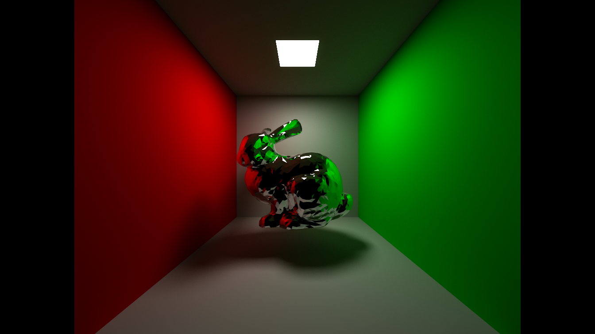
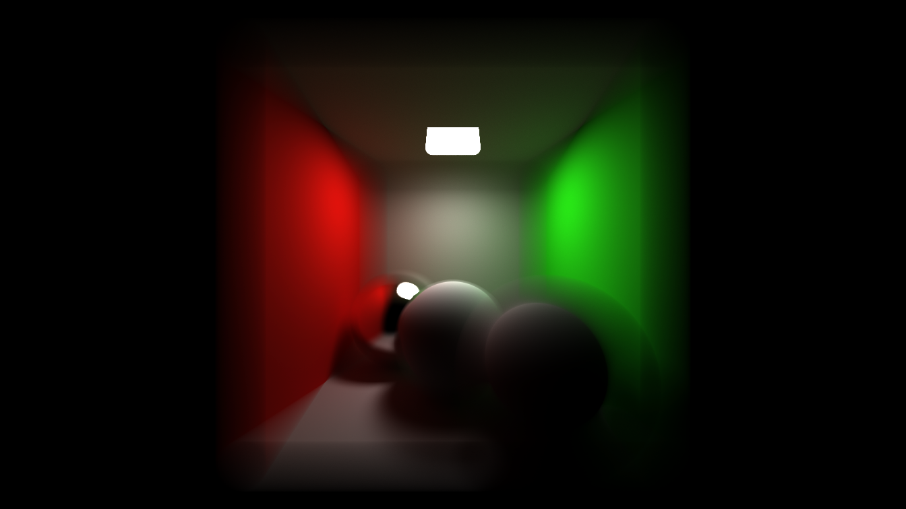

# Cuda_path_tracer

A cuda-based path tracer for graphical code practice, which is all implemented in cuda.

# Features

- Parallel construction of BVH (LBVH) accelerated structures.
- Implement diffuse materials, metal materials and dielectric material.
- Implement light source importance sampling with AABB as a carrier
- Support model import.

# Preview

# Dependency

- CUDA.
- Obj_loader in games101 Assignment 6.

# Reference

- [GAMES101:《现代计算机图形学入门》](https://sites.cs.ucsb.edu/~lingqi/teaching/games101.html)
- [Maximizing Parallelism in the Construction of BVHs, Octrees, and k-d Trees](https://research.nvidia.com/sites/default/files/pubs/2012-06_Maximizing-Parallelism-in/karras2012hpg_paper.pdf)
- [Ray Tracing in One Weekend](https://github.com/RayTracing/raytracing.github.io)

